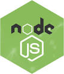

### Hi there 👋, My name is Festus Peter Agbo
#### Backend Developer || Tech enthusiast

#### Connect with me 

 #### My Core Languages
<code></code>
<code></code>
<code></code>

#### Frameworks I use
<code></code>
<code></code>

#### Tools I Use
<code></code>
<code></code>
<code></code>
<code></code>
<code></code>

      

